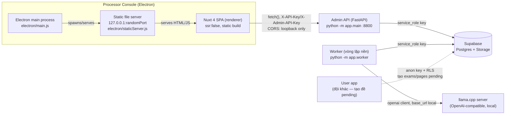

# DocxOCR — Báo cáo thiết kế (Processor side)

Tài liệu này mô tả những gì đã được triển khai trong `Processor/backend`
(admin API + worker) và `Processor/frontend` (Electron console cho người
vận hành), đối chiếu với `Processor/backend_requirements.md`. Cùng vai trò
với `User/DESIGN_REPORT.md` bên phía User — tài liệu tổng quan cấp hệ
thống. Phần chi tiết từng module của backend đã có sẵn ở
`Processor/backend/DESIGN_REPORT.md` (đầy đủ hơn nhiều so với những gì lặp
lại ở đây) — báo cáo này tóm tắt lại backend ở mức tổng quan (§4) và đi sâu
vào phần **mới**, chưa có tài liệu riêng: `Processor/frontend` (§3).

---

## 1. Tổng quan kiến trúc



Processor gồm **ba tiến trình độc lập, ba chỗ khởi động**: worker (vòng lặp
nền, không phải HTTP), admin API (FastAPI/uvicorn), và console vận hành
(Electron). Không tiến trình nào spawn tiến trình khác — khác với User side
(nơi Electron tự spawn sidecar FastAPI của chính nó) vì admin API và worker
ở đây là dịch vụ backend triển khai độc lập với vòng đời riêng (có thể chạy
trên máy/server khác với máy chạy console), console chỉ là một client HTTP
trỏ vào đó.

**Vì sao console cũng cần static server thay vì `loadFile` (file://)** —
lý do giống hệt User side: renderer cần `fetch()` sang admin API bằng
`X-API-Key`/`X-Admin-API-Key`; nếu renderer chạy trên `file://`, Chromium
gửi `Origin: null`, không allow-list được. Serve qua
`http://127.0.0.1:<port>` cho renderer một origin thật để
`app/main.py`'s `CORSMiddleware` allow-list chính xác (xem §3.7, §4).

**Đây là thay đổi lớn nhất với backend trong đợt này**: trước khi có
console, `app/main.py` **không** bật `CORSMiddleware` (giả định "không
browser nào gọi thẳng"). Console tồn tại → giả định đó sai → đã thêm
`CORSMiddleware` với `allow_origin_regex` chỉ khớp 2 dạng loopback
(`localhost:3000` dev, `127.0.0.1:<port ngẫu nhiên>` bản đóng gói) — xem
§4 và `Processor/backend/DESIGN_REPORT.md` (mục CORS).

---

## 2. Cấu trúc thư mục

```
Processor/
├── backend_requirements.md
├── DESIGN_REPORT.md                     (tài liệu này)
├── backend/                             (FastAPI admin API + worker)
│   ├── DESIGN_REPORT.md                 (chi tiết từng module — xem §4)
│   ├── app/  (config/, schemas/, repositories/, storage/, controllers/, services/)
│   ├── migrations/, tests/
│   └── requirements.txt / .env.example
└── frontend/                            (Nuxt 4 + Electron — console vận hành)
    ├── app/
    │   ├── assets/css/main.css          (design tokens — copy từ User/frontend)
    │   ├── components/{layout,shared}/
    │   ├── composables/                 (useProcessorApi, useToast)
    │   ├── stores/                      (Pinia: exams.ts, dashboard.ts)
    │   ├── pages/                       (exams/index.vue, exams/[id].vue, dashboard.vue)
    │   ├── types/models.ts
    │   └── utils/format.ts
    ├── electron/                        (main.js, preload.js, staticServer.js)
    ├── electron-builder.yml
    ├── nuxt.config.ts / package.json / .env.example
    └── scripts/wait-and-launch-electron.mjs
```

> **Vì sao `frontend/` không có `sidecar.js` như bên User?** Console không
> tự spawn admin API — API đó là một dịch vụ backend triển khai/chạy độc
> lập (có thể trên máy khác), console chỉ là client trỏ vào bằng
> `NUXT_PUBLIC_PROCESSOR_API_URL`. Không có tiến trình con nào để
> spawn/kill, nên không cần `sidecar.js` hay IPC phức tạp trong
> `preload.js` (chỉ expose đúng `appVersion`).

---

## 3. Frontend (`Processor/frontend`) — chi tiết từng phần

### 3.1 Quyết định kiến trúc chính

**Cấu hình qua biến env build-time, không phải màn hình "connect" runtime.**
Giống cách `User/frontend` bake `NUXT_PUBLIC_SUPABASE_URL`/`ANON_KEY` qua
`runtimeConfig.public`, console này bake `NUXT_PUBLIC_PROCESSOR_API_URL` +
`_API_KEY` + `_ADMIN_API_KEY`. Phương án bị loại: màn hình nhập API key rồi
lưu `localStorage` — `electron/staticServer.js` chọn **port ngẫu nhiên** mỗi
lần mở app (`findFreePort()`, giống hệt cơ chế sidecar bên User), nên origin
của renderer đổi mỗi lần khởi động và `localStorage` sẽ không giữ được giá
trị qua các lần mở app khác nhau. Biến env tránh hẳn vấn đề này.

**Không có Supabase client nào trong app này** — khác hẳn `User/frontend`.
Toàn bộ dữ liệu đi qua admin API (`X-API-Key`/`X-Admin-API-Key`), không bao
giờ cầm `service_role` hay `anon` key trực tiếp — đúng lý do admin API tồn
tại (môi giới quyền truy cập thay vì phát key cho client).

**Polling thay vì realtime.** Không có Supabase client → không có kênh
`postgres_changes` để subscribe như `stores/documents.ts` bên User. Mỗi
store tự poll endpoint tương ứng theo interval khi trang liên quan đang
mount, dừng khi unmount:

| Store | Endpoint | Interval | Điều kiện |
|---|---|---|---|
| `stores/exams.ts` (list) | `GET /processor/exams` | 5s | khi ở route `/exams/*` |
| `stores/exams.ts` (detail) | `GET /processor/exams/{id}` | 3s | chỉ khi `status === 'processing'` |
| `stores/dashboard.ts` | `GET /processor/dashboard` + `GET /health` | **15s** (chậm hơn hẳn 2 store kia — xem §3.5 vì sao) | khi ở route `/dashboard` |

### 3.2 Theme — `app/assets/css/main.css`

Copy nguyên token thiết kế từ `User/frontend/app/assets/css/main.css`
(`--bg/--surface/--ink/--accent/--pending/--processing/--finished/--danger`,
font Be Vietnam Pro + IBM Plex Mono, `.btn/.badge/.hint/.toast`) để hai app
dùng chung một ngôn ngữ hình ảnh. Thêm 2 thứ User chưa cần:
- `.badge.failed`/`.dot.failed` (dùng `--danger`/`--danger-bg` đã có sẵn
  nhưng chưa từng được dùng cho badge, vì User chưa hiển thị trạng thái
  `failed` ở UI của họ — xem `User/DESIGN_REPORT.md` §9).
- `.progress-track`/`.progress-fill`, `.stat-card` — User không có màn hình
  nào cần progress bar độc lập hay stat card (Processor thì có, cho
  `exams/[id].vue` và `dashboard.vue`). `UsageBar.vue` (§3.6) tái dùng
  `.progress-track`/`.progress-fill` này, chỉ thêm 2 class màu
  `.safe`/`.alert` đè lên màu mặc định.

### 3.3 Types — `app/types/models.ts`

Mirror 1:1 `Processor/backend/app/schemas/dto.py` + `schemas/models.py`:
`ExamStatus` (**4 giá trị** — `pending/processing/finished/failed`, khác
`User/frontend`'s `ExamStatus` chỉ có 3, vì User chưa hiển thị `failed`),
`ExamListItem`, `ExamDetail`, `PageRecord`, `DocumentLayout`/`OcrPageResult`
(cùng hình dạng với `User/frontend/app/types/models.ts` — cả 3 nơi này
cùng mirror một contract, xem `Processor/backend/DESIGN_REPORT.md` §6.3),
`EnqueueResponse`/`RetryResponse`/`ResetResponse`, `WorkerHeartbeat`/
`StatusCounts`/`DashboardResponse` (thay `WorkerStatusResponse` cũ — đã xoá
cùng lúc gộp `/worker` + `/admin` thành `/dashboard`, xem §3.5/§4).

### 3.4 `app/composables/useProcessorApi.ts`

Một hàm `call()` trung tâm gắn header `X-API-Key` cho **mọi** request; chỉ
riêng `resetAll()` gắn thêm `X-Admin-API-Key`. Đây là nơi duy nhất trong
frontend biết 2 header này tồn tại — mọi store/page gọi qua composable,
không tự set header. `apiErrorMessage()` lấy đúng field `detail` mà
FastAPI's `HTTPException` trả về (vd
`ProcessingCapacityExceededError`/`InvalidExamStateError`/
`DestructiveOpsDisabledError` từ backend), để toast hiển thị lý do thật
thay vì "lỗi không xác định".

### 3.5 Stores (Pinia)

**`stores/exams.ts`**: 4 danh sách theo status (`byStatus` getter), 
`activeExam` (chi tiết đang xem), polling như bảng ở §3.1. `_syncDetailPolling()`
chỉ bật interval khi `activeExam.status === 'processing'` — một đề
`finished`/`failed` không tự đổi nên không có lý do poll lại nó. 3 action
tương ứng 3 nút hành động: `enqueue`/`retry`/`requeue`, mỗi cái refetch
list + detail (nếu đang mở đúng đề đó) sau khi gọi API thành công, và
toast lỗi cụ thể khi thất bại (qua `apiErrorMessage`).

**`stores/dashboard.ts`** (thay `stores/worker.ts` cũ, gộp cả phần trước đây
nằm trong `admin.vue`): `fetchDashboard()` gọi song song `getDashboard()` +
`health()` (`Promise.all`) — health check của chính Processor API
(`apiHealthy`) độc lập với `llamacpp_healthy` (nay đến từ response, không
phải tự suy luận ở frontend) — health lỗi không nên chặn hiển thị phần còn
lại nếu API vẫn trả được, nên bọc riêng `.catch()` cho nhánh health thay vì
để lỗi của nó làm hỏng toàn bộ fetch. Poll chậm hơn (15s, xem §3.1) vì
`db_size_bytes`/`storage_size_bytes` đi qua Supabase Management API phía
backend (§4) — API đó dành cho dùng thi thoảng/tooling, không phải để poll
tần suất cao như PostgREST. `resetAll()` (chuyển từ component-local state
trong `admin.vue` cũ vào store) gọi `resetAll()` API rồi refetch cả
`dashboard.ts` lẫn `useExamsStore().fetchLists()` — reset xoá sạch mọi đề
nên cả 2 danh sách đều cần cập nhật lại; `lastResetResult` giữ
`ResetResponse` đầy đủ (số đề/trang/object đã xoá, danh sách object xoá
thất bại) để `dashboard.vue` hiển thị đúng như `admin.vue` cũ từng làm.

### 3.6 Components đáng chú ý

- **`layout/PrimarySidebar.vue`**: rail **2 icon** (Đề/Dashboard) — trước
  đây là 3 (Đề/Worker/Admin); Worker + Admin đã gộp thành `/dashboard` theo
  yêu cầu (xem §4 vì sao gộp cả ở backend). Cùng style rail tối màu như
  User, chỉ 1 tầng điều hướng (không có `SecondarySidebar` riêng cho từng
  mục như User có Upload/Documents khác nhau).
- **`layout/SecondarySidebar.vue`**: danh sách đề nhóm theo 4 trạng thái
  (thêm nhóm `failed` so với 3 nhóm bên User) — chỉ render khi route đang ở
  `/exams/*` (điều kiện nằm ở `app.vue`, không phải trong chính component),
  vì `/dashboard` là toàn màn hình, không cần danh sách phụ.
- **`pages/exams/[id].vue`**: **không** hiển thị ảnh trang — khác hẳn
  `docs/FinishedPanel.vue` bên User (có xem ảnh + văn bản song song). Admin
  API không trả signed URL/bytes ảnh (chỉ trả `ocr_text` đã parse), và đây
  là màn hình giám sát vận hành chứ không phải trình xem tài liệu — mỗi
  trang chỉ hiện "đã xử lý hay chưa" + tóm tắt số khối/loại khối tính từ
  `ocr_text.layouts` (`Title×1, Text×5, Table×2`...) — đủ để phát hiện
  bất thường (vd 1 trang OCR ra 0 khối) mà không cần tải ảnh.
- **`pages/dashboard.vue`** (thay `worker.vue` + `admin.vue` cũ, gộp làm
  1): 4 stat card đếm đề theo status (mới — dùng `StatusCounts`, xem §3.3),
  2 chỉ báo health riêng biệt (llama.cpp từ `dashboard_service.py`, Processor
  API tự `GET /health` như cũ), danh sách worker đang xử lý (y hệt
  `worker.vue` cũ), 2 `UsageBar` (DB/Storage, xem dưới), và vùng nguy hiểm
  reset (y hệt `admin.vue` cũ, chỉ chuyển state vào `dashboard.ts` — xem
  §3.5) — khoá nút xoá sau ô nhập phải gõ đúng chuỗi `"XÓA HẾT"` (so sánh
  reactive đơn giản, không cần thư viện modal). Nút vẫn có thể bấm được kể
  cả khi backend sẽ từ chối (`PROCESSOR_ENV` không phải dev/staging);
  trường hợp đó xử lý bằng cách đọc `detail` từ lỗi 403 trả về
  (`DestructiveOpsDisabledError`) và hiện đúng lý do, thay vì chặn trước ở
  UI (frontend không biết `PROCESSOR_ENV` hiện tại là gì — không có
  endpoint nào trả field đó, không đổi so với trước).
- **`shared/UsageBar.vue`** (mới): props `label`/`bytes`/`thresholdBytes`.
  `bytes === null` → hiện "chưa cấu hình" (không phải lỗi — nghĩa là
  `PROCESSOR_SUPABASE_ACCESS_TOKEN` chưa được set, xem §4/§6). Chỉ **2
  trạng thái màu** theo đúng yêu cầu ("an toàn hoặc báo động", không phải
  gradient 3 mức): xanh (`--finished`) khi dưới ngưỡng, đỏ (`--danger`) khi
  bằng/vượt ngưỡng — vượt ngưỡng không chặn gì cả, chỉ đổi màu. Thanh fill
  luôn cắt ở 100% chiều rộng kể cả khi vượt ngưỡng thật (vd 150%), nhưng
  chữ số phần trăm/byte thật vẫn hiện đúng, không bị cắt theo. 2 ngưỡng
  500MB (DB)/1GB (Storage) hardcode ngay trong `dashboard.vue`, không phải
  cấu hình từ backend — đúng như yêu cầu "phía frontend hiển thị thêm
  mốc", vì đây là quyết định hiển thị/UX thuần tuý, backend chỉ cần trả số
  byte thật.

### 3.7 Electron

| File | Vai trò |
|---|---|
| `main.js` | Rút gọn nhiều so với User: không `sidecar.js`, không IPC `save-file` (console không xuất file). Chỉ: single-instance lock, tạo `BrowserWindow`, `startStaticServer` (prod) hoặc trỏ `localhost:3000` (dev). |
| `preload.js` | Chỉ expose `appVersion` qua `contextBridge` — không có gì khác cần lộ ra renderer. |
| `staticServer.js` | Giống hệt bản User (HTTP thuần, `http`+`fs`, fallback `index.html` cho route SPA) — khác 1 chỗ: `findFreePort()` viết thẳng trong file này (User import từ `sidecar.js`, ở đây không có file đó để import). |

### 3.8 CORS — vì sao đây là thay đổi bắt buộc ở backend, không chỉ ở frontend

`Processor/backend/app/main.py` trước đây không bật `CORSMiddleware`
(§1). Đã thêm, với `allow_origin_regex=r"^http://(localhost:3000|127\.0\.0\.1:\d+)$"`,
`allow_headers` chỉ mở đúng `Content-Type`/`X-API-Key`/`X-Admin-API-Key`
(không wildcard — 2 header key này chính là thứ cần bảo vệ). Đã verify
bằng `curl` thật: preflight `OPTIONS` trả đúng
`Access-Control-Allow-Origin` cho cả 2 origin hợp lệ, request thật từ
origin lạ (`evil.example.com`) không nhận được header đó (browser sẽ tự
chặn) — xem §7.

---

## 4. Backend (`Processor/backend`) — tổng quan

Chi tiết từng module đã có ở `Processor/backend/DESIGN_REPORT.md` (11
mục, ~800 dòng) — phần này chỉ tóm tắt để báo cáo tổng quan này tự đứng
được, không lặp lại nội dung đã có.

Hai tiến trình độc lập cùng codebase: **admin API** (`python -m app.main`
— xem danh sách đề, enqueue, reset, worker status) và **worker**
(`python -m app.worker` — vòng lặp nền: claim đề `processing`, preprocess
ảnh, gọi llama.cpp, ghi kết quả). Cả hai dùng `service_role` key, bypass
RLS. Kiến trúc concurrency của worker: **mỗi trang 1 coroutine async**,
giới hạn bằng `asyncio.Semaphore(max_concurrent_pages)` — không dùng
thread, không còn khái niệm "gộp N ảnh vào 1 request" của bản đầu (xem
`Processor/backend/DESIGN_REPORT.md` §4.8/§4.11).

**3 lỗi thật phát hiện và sửa trong lần rà soát cuối** (chi tiết đầy đủ ở
`Processor/backend/DESIGN_REPORT.md` §4.9/§4.11):
1. **Worker crash sau đề đầu tiên**: `OcrClient` bọc `AsyncOpenAI`, mà
   `httpx.AsyncClient` bên dưới pool connection gắn với event loop đầu
   tiên dùng nó. Bản trước gọi `asyncio.run()` riêng cho mỗi đề (mỗi lần
   tạo/đóng 1 loop mới) nhưng dùng chung 1 `OcrClient` cho cả đời worker →
   đề thứ 2 trở đi `RuntimeError: Event loop is closed`. Đã tái hiện bằng
   test tách biệt, sửa bằng cách gộp thành **1 `asyncio.run()` duy nhất**
   cho toàn bộ vòng đời worker (`app/worker.py` gọi
   `asyncio.run(worker.run_forever())` đúng 1 lần).
2. **Coroutine "mồ côi" ghi vào đề đã failed**: hệ quả của fix #1 — nếu 1
   trang lỗi theo cách không phải `OcrConnectivityError`/`OcrBatchError`
   (vd lỗi decode ảnh), exception đó lọt ra `asyncio.gather()`, mà
   `gather()` không huỷ các coroutine khác — trên event loop persistent,
   chúng tiếp tục chạy nền sang cả đề tiếp theo. Sửa bằng cách bắt hết
   `Exception` ngay trong từng coroutine.
3. **Mô tả ảnh/biểu đồ bị mất trắng**: `OCR_PROMPT` yêu cầu model ghi mô tả
   vào `alt` của ``, nhưng `BeautifulSoup.get_text()` chỉ lấy text
   node, bỏ qua attribute → mọi block `Picture` có `text=""`. Sửa bằng
   cách thay `` bằng giá trị `alt` của nó trước khi flatten.

**4. CORS** (mới, để phục vụ `Processor/frontend`) — xem §1, §3.8.

**5. Dashboard** (mới, `GET /processor/dashboard`, xem
`Processor/backend/DESIGN_REPORT.md` §4.16): gộp hẳn `GET
/processor/worker/status` cũ (đã xoá, cùng `controllers/worker_status.py`)
theo đúng yêu cầu gộp trang Worker+Admin thành 1 Dashboard phía frontend,
cộng đếm đề theo status (`StatusCounts`, dùng `repositories/exams.py::
count_by_status()` có sẵn từ trước, trước đó chưa ai gọi) và dung lượng
DB/Storage. Điểm đáng chú ý nhất: 2 số liệu dung lượng **không** đi qua
PostgREST/`service_role` như mọi thứ khác trong Processor — PostgREST
không có cách chạy `pg_database_size()`/tổng `storage.objects.metadata`
dưới dạng SQL tuỳ ý, nên đi qua **Supabase Management API** thay vào đó
(`services/supabase_management.py`), cần thêm 1 credential mới —
**personal access token** (`PROCESSOR_SUPABASE_ACCESS_TOKEN`, tuỳ chọn) —
scope theo tài khoản Supabase, rộng hơn hẳn `service_role` key vốn chỉ
giới hạn 1 project. Đây là đánh đổi bạn đã cân nhắc và chọn trực tiếp
(phương án còn lại — viết migration tạo 2 function RPC gọi qua
`service_role` như bình thường — không cần credential mới nhưng cần 1
migration; bạn chọn Management API). Cả 2 hàm trong
`supabase_management.py` không raise ở bất kỳ nhánh lỗi nào (thiếu token,
lỗi mạng, status khác 200) — chỉ log & trả `None`, để 1 dashboard cấu hình
thiếu token không làm hỏng các field còn lại của response.

---

## 5. Supabase — vai trò trong Processor

Không có schema/migration mới do phía Processor sở hữu ngoài
`migrations/0001_processor_worker_columns.sql` (thêm `claimed_by`/
`claimed_at` và giá trị status `failed` vào bảng `exams` đã có sẵn từ
`User/supabase/schema.sql`). Processor **không** dùng RLS — cả admin API
và worker đều dùng `service_role` key, bypass hoàn toàn. Bucket Storage
(`exam-pages`) dùng chung với User; Processor chỉ thêm quy ước prefix
`processing/` khi enqueue (xem `Processor/backend/DESIGN_REPORT.md` §4.1).

---

## 6. Biến môi trường & tham số còn thiếu (⚠️ cần bạn bổ sung)

### `Processor/backend/.env`
Đầy đủ ở `Processor/backend/.env.example` — các mục `*** TODO — bổ sung ***`
(Supabase URL/service_role key, llama.cpp base URL/model, 2 API key) là bắt
buộc trước khi chạy thật, xem `Processor/backend/DESIGN_REPORT.md` §7.
Riêng `PROCESSOR_SUPABASE_ACCESS_TOKEN` (personal access token — Dashboard
→ Account → Access Tokens trên Supabase, khác `SERVICE_ROLE_KEY`) là
**tuỳ chọn** — thiếu chỉ khiến `db_size_bytes`/`storage_size_bytes` trong
`GET /processor/dashboard` trả `null` (frontend hiện "chưa cấu hình"),
không chặn chạy các tính năng khác.

### `Processor/frontend/.env` (copy từ `.env.example`)
| Biến | Mô tả | Trạng thái |
|---|---|---|
| `NUXT_PUBLIC_PROCESSOR_API_URL` | Base URL admin API | ✅ mặc định `http://127.0.0.1:8800`, đổi nếu API chạy máy/port khác |
| `NUXT_PUBLIC_PROCESSOR_API_KEY` | Phải khớp `PROCESSOR_API_KEY` bên backend | ❌ **chưa có — cần bạn điền, phải trùng với backend** |
| `NUXT_PUBLIC_PROCESSOR_ADMIN_API_KEY` | Phải khớp `PROCESSOR_ADMIN_API_KEY` bên backend | ❌ **chưa có — cần bạn điền, phải trùng với backend** |

### Cần bạn/đội quyết định thêm
1. **Icon ứng dụng** trong `Processor/frontend/electron-builder.yml` —
   `productName`/`appId` đã chốt (`DocxOCR Processor` /
   `com.docxocr.processor`), còn thiếu file `.ico`/`.icns` trước khi phát
   hành bản cài đặt thật.
2. **Toàn bộ tham số còn thiếu của backend** — xem
   `Processor/backend/DESIGN_REPORT.md` §7 (không lặp lại ở đây).

---

## 7. Đã build & kiểm thử những gì

- **Backend — CORS**: chạy `uvicorn` thật, `curl` preflight `OPTIONS` +
  request thật với `Origin: http://localhost:3000` và
  `Origin: http://127.0.0.1:54321` → cả 2 nhận đúng
  `Access-Control-Allow-Origin`; `Origin: http://evil.example.com` → không
  nhận header đó (browser tự chặn). `pytest` (3/3) chạy lại sau thay đổi,
  không hỏng gì.
- **Backend — 3 lỗi ở §4**: mỗi lỗi đều tái hiện được bằng test viết riêng
  trước khi sửa (không chỉ đọc code đoán), rồi test lại sau khi sửa: lỗi
  #1 tái hiện bằng 2 lệnh `asyncio.run()` liên tiếp dùng chung 1
  `httpx.AsyncClient` (crash ở lần 2), xác nhận gộp 1 `asyncio.run()` chạy
  3 lần liên tiếp không lỗi, cộng thêm 1 test end-to-end mô phỏng 2 đề nối
  tiếp qua `run_forever` thật (server HTTP giả lập llama.cpp). Lỗi #2 test
  bằng 4 trang giả, ép 1 trang lỗi giữa chừng — xác nhận 0 coroutine còn
  treo, 3 trang lành vẫn lưu xong. Lỗi #3 test trực tiếp
  `parse_layout_response` trước/sau fix, cộng thêm case `` xen giữa
  text khác và case `Table` không bị đụng vào.
- **Backend — Dashboard**: dựng 1 HTTP server giả lập Supabase Management
  API thật (không có project/token thật trong sandbox này) để test
  `supabase_management.py` — xác nhận đúng URL (`/v1/projects/{ref}/
  database/query`, `ref` tách đúng từ `PROCESSOR_SUPABASE_URL`), đúng
  header `Authorization: Bearer <token>`, parse đúng response cho cả 2 câu
  SQL, và **3 nhánh lỗi đều trả `None` chứ không raise**: thiếu token
  (không gọi HTTP luôn), lỗi mạng, response 401. Test riêng
  `dashboard_service.py::get_dashboard()` với mock đầy đủ (health/active
  claims/counts/2 hàm size) — xác nhận lắp đúng `DashboardResponse`.
  `pytest` (3/3) + `compileall` chạy lại sau toàn bộ thay đổi, không hỏng gì.
- **Frontend**: `npm run typecheck` sạch (không lỗi kiểu nào từ
  `DashboardResponse`/`StatusCounts`/`UsageBar` mới), `npm run generate`
  build production thành công — 4 route còn lại (`/`, `/exams`,
  `/exams/[id]`, `/dashboard` — giảm từ 5 sau khi gộp `/worker`+`/admin`),
  không lỗi compile nào ở `dashboard.vue`/`UsageBar.vue`/`stores/dashboard.ts`.
  Dựng 1 mock admin API trả đúng shape `DashboardResponse` thật, cố tình
  đặt `db_size_bytes` **vượt** ngưỡng 500MB (600MB) và `storage_size_bytes`
  **dưới** ngưỡng 1GB (200MB) để bài test chạm đúng cả 2 nhánh màu — chạy
  `npm run dev` thật trỏ vào mock đó, xác nhận `runtimeConfig.public` nạp
  đúng `.env`, dev server phục vụ `/dashboard` không lỗi 500, và
  `curl` xác nhận response JSON đúng shape server trả về. **Chưa xác nhận
  được bằng mắt** màu xanh/đỏ thật sự hiện đúng trong DOM (không có trình
  duyệt/công cụ browser automation trong môi trường này — xem hạn chế
  ngay dưới) — chỉ xác nhận logic `isAlert`/`percent` trong `UsageBar.vue`
  đúng bằng cách đọc lại code (600MB/500MB ≥ 1 → alert; 200MB/1GB < 1 →
  safe), không phải chạy trực tiếp.
- **Chưa/không thể kiểm thử trong môi trường này** (giống hệt hạn chế bên
  User, xem `User/DESIGN_REPORT.md` §8): không có trình duyệt thật/công cụ
  browser automation để click-through UI thật (xác nhận bằng mắt nút bấm,
  polling, toast chạy đúng trong DOM), và không có Supabase project/
  llama.cpp server thật để chạy full integration end-to-end. **Bạn nên tự
  chạy `npm run electron:dev` trỏ vào backend thật** (đã điền `.env` cả 2
  phía) và thao tác qua luồng thật — enqueue 1 đề pending, xem progress
  tăng, thử retry/requeue 1 đề failed, xác nhận reset bị chặn đúng ngoài
  dev/staging — trước khi coi là hoàn thành.

---

## 8. Hạn chế đã biết / việc còn để ngỏ có chủ đích

1. **Không hiển thị ảnh trang** ở `exams/[id].vue` — cố ý, xem §3.6. Nếu
   sau này cần xem ảnh thật từ console, admin API cần thêm 1 endpoint trả
   signed URL/bytes (hiện chưa có, vì đây là màn hình giám sát, không phải
   trình xem tài liệu).
2. **Không có cách biết `PROCESSOR_ENV` hiện tại từ frontend** — nút reset
   ở `dashboard.vue` (trước đây `admin.vue`) luôn hiện là bấm được, chỉ báo
   lỗi *sau khi* bấm nếu backend từ chối (403). Chưa thêm field này vào
   response nào cả vì không có endpoint "config" chung — cân nhắc thêm nếu
   trải nghiệm "bấm rồi mới biết bị chặn" gây khó chịu cho người vận hành.
3. **Icon/appId Electron còn placeholder** — xem §6 mục 1.
4. **Node engine / npm --legacy-peer-deps** — cùng hạn chế đã ghi ở
   `User/DESIGN_REPORT.md` §9 mục 1, không lặp lại chi tiết ở đây.
5. **`electron-builder.yml` chưa từng chạy thật** (`npm run
   electron:build`) — chưa đóng gói thử bản cài đặt thật trong lần này.
6. **Management API cho DB/Storage size chưa test được với token/project
   thật** (xem §7) — sandbox này không có tài khoản Supabase thật để tạo
   personal access token. Rate limit thật của API này cũng chưa rõ, nên
   khoảng poll 15s ở `dashboard.ts` (§3.1/§3.5) là lựa chọn thận trọng ban
   đầu, có thể cần chỉnh lại sau khi thấy hành vi thật trên project thật.

---

## 9. Bảng phiên bản dependency

### Frontend (`Processor/frontend/package.json`)
| Package | Version | Ghi chú |
|---|---|---|
| nuxt | ^4.5.0 | |
| @pinia/nuxt | ^1.0.1 | |
| pinia | ^4.0.2 | |
| @lucide/vue | ^1.25.0 | |
| electron | ^43.1.1 | |
| electron-builder | ^26.15.3 | |
| typescript | ^5.7.3 | |

Không có `@supabase/supabase-js`/`vuedraggable` — không cần (xem §3.1,
§3.6). Cài đặt cần `--legacy-peer-deps` — cùng bug npm 10.9 Arborist đã
gặp và ghi lại ở `User/DESIGN_REPORT.md` §10, tái hiện lại y hệt ở app
này (không liên quan gì tới package cụ thể nào ở đây).

### Backend
Xem `Processor/backend/DESIGN_REPORT.md` §8/tương đương — không đổi gì
về dependency trong lần rà soát này (chỉ sửa code, không thêm package
mới; `CORSMiddleware` là một phần của `fastapi` đã có sẵn).

---

## 10. Cách chạy thử

```bash
# 1. Backend — admin API
cd Processor/backend
python -m venv .venv && .venv\Scripts\activate
pip install -r requirements.txt
copy .env.example .env        # điền Supabase/llama.cpp/2 API key
python -m app.main            # admin API — http://127.0.0.1:8800

# 2. Backend — worker (terminal khác)
cd Processor/backend
.venv\Scripts\activate
python -m app.worker

# 3. Frontend (terminal khác)
cd Processor/frontend
copy .env.example .env        # điền 2 API key, phải khớp backend
npm install --legacy-peer-deps
npm run electron:dev          # chạy Nuxt dev + mở cửa sổ Electron trỏ vào đó
```
