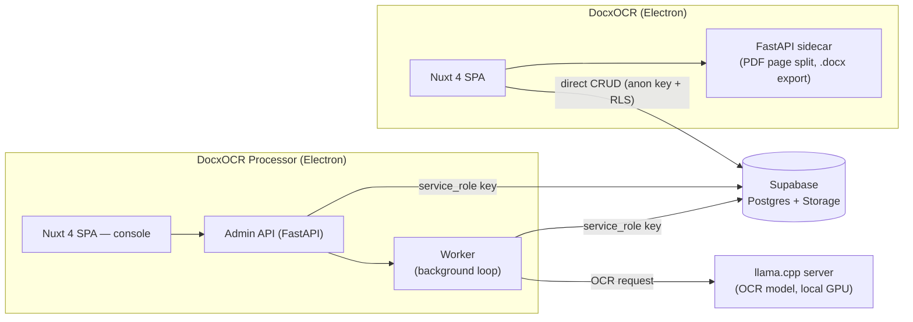

# DocxOCR

A system for digitizing exam papers/documents via OCR, made of two
independent desktop apps sharing one **Supabase** database:

- **DocxOCR** — where end users upload documents, track processing
  status, and export OCR results to `.docx`.
- **DocxOCR Processor** — the internal operator console that picks up
  documents from DocxOCR, runs OCR with a local model (`llama.cpp`), and
  writes results back to Supabase.

The two apps never call each other directly — everything flows through
the `exams`/`pages` tables on Supabase (one side creates a document in
`pending` state, the other claims and processes it).

**Core capability**: reconstructing raw OCR output — flat text blocks with
bounding boxes, no structure — into a `.docx` file that preserves most of the
original layout (columns, sections, tables, text styling).

---

## Architecture overview



Each app is a self-contained Electron package bundling its frontend
(Nuxt 4) and local backend (FastAPI) — users only ever launch one icon,
with no awareness of the processes running underneath.

---

## Directory structure

```
ocr2.0/
├── User/                      # DocxOCR — document submission app
│   ├── frontend/               # Nuxt 4 + Electron
│   ├── backend/                 # FastAPI sidecar (PDF split, export)
│   ├── supabase/                # schema.sql, storage.sql
│   └── DESIGN_REPORT.md         # Detailed design notes
├── Processor/                 # DocxOCR Processor — operator console
│   ├── frontend/                # Nuxt 4 + Electron
│   ├── backend/                  # Admin API + worker (FastAPI)
│   ├── Llama/                    # llama.cpp runtime + OCR binaries
│   └── DESIGN_REPORT.md         # Detailed design notes
├── Reformat_prototype/        # Reference code for the export/reformat pipeline (legacy system)
└── Test/                      # Layout model (BiLSTM-CRF) experiments + research notes
```

---

## Tech stack

| Component | Technology |
|---|---|
| Frontend (both apps) | Nuxt 4, Pinia, packaged with Electron |
| Local backend (User) | FastAPI + PyMuPDF (PDF split) + internal export pipeline |
| Backend (Processor) | FastAPI (admin API) + async worker, OpenAI-compatible client to llama.cpp |
| OCR model | `llama.cpp` server running locally, requires an NVIDIA (CUDA) GPU |
| Layout reconstruction (export) | Rule-based (DP + union-find), or an experimental BiLSTM-CRF model |
| Data & storage | Supabase (Postgres + Storage) — RLS on the User side, `service_role` on the Processor side |

---

## Getting started

Both apps ship as installers — no manual setup beyond a shared Supabase
project.

**1. Supabase** — create a project, run `User/supabase/schema.sql` then
`User/supabase/storage.sql` in the SQL editor, and enable **Realtime** on
the `exams` table. Grab the project URL, anon key (for DocxOCR), and
service_role key (for DocxOCR Processor, keep secret).

**2. DocxOCR** — the anon key/URL are baked into the installer at build
time: fill `User/frontend/.env`, run `npm run electron:build`, then
install the generated `.exe`.

**3. DocxOCR Processor** — install the app, then create an `.env` file
next to `ocr-processor-backend.exe` in the install folder (copy from
`Processor/backend/.env.example`) with `PROCESSOR_SUPABASE_URL` and
`PROCESSOR_SUPABASE_SERVICE_ROLE_KEY`, and restart the app. On first
launch it auto-downloads the OCR model (~4.2GB, requires an NVIDIA/CUDA
GPU) and starts `llama.cpp` on its own.

**4. Try it end-to-end** — upload a document in DocxOCR (→ `Pending`) →
`Enqueue` it in DocxOCR Processor (→ `Processing` → `Finished`) → back in
DocxOCR, open the document and export the `.docx`.

Full walkthrough, including troubleshooting, is not written yet.