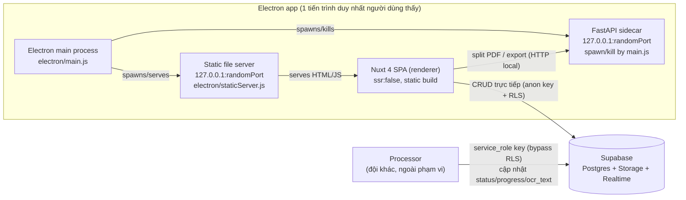

# DocxOCR — Báo cáo thiết kế (User side)

Tài liệu này mô tả những gì đã được triển khai trong `User/frontend` và
`User/backend`, đối chiếu với `architecture_and_requirements.md` và
`design_prototype.html`. Đây là bản triển khai đầy đủ luồng end-to-end
(trừ phần lõi export — xem §7), đã được build và kiểm thử theo từng lớp
(xem §8) chứ không chỉ là khung sườn.

---

## 1. Tổng quan kiến trúc



Ba tiến trình logic, một điểm khởi động: người dùng chỉ mở **một** ứng
dụng Electron. `electron/main.js` tự spawn sidecar FastAPI và một static
file server nội bộ, rồi tắt cả hai khi đóng ứng dụng (`before-quit`,
`window-all-closed`, `process.on('exit')`).

**Vì sao có static server thay vì `loadFile` (file://) trực tiếp?**
Renderer cần gọi `fetch()` sang sidecar FastAPI. Nếu renderer chạy trên
`file://`, Chromium gửi `Origin: null`, khiến việc cấu hình CORS chặt chẽ
(chỉ cho phép đúng origin renderer) trở nên khó kiểm soát. Serve SPA qua
`http://127.0.0.1:<port>` cho renderer một origin thật, để FastAPI
allow-list chính xác origin đó — xem `electron/staticServer.js` và
`app/main.py`'s `CORSMiddleware`.

---

## 2. Cấu trúc thư mục

```
User/
├── architecture_and_requirements.md   (nguồn yêu cầu — không đổi)
├── design_prototype.html              (tham chiếu UI gốc — không đổi)
├── DESIGN_REPORT.md                   (tài liệu này)
├── supabase/
│   ├── schema.sql                     (bảng exams/pages + RLS)
│   └── storage.sql                    (bucket exam-pages + policies)
├── frontend/                          (Nuxt 4 + Electron)
│   ├── app/                           (Nuxt 4 srcDir mặc định)
│   │   ├── assets/css/main.css        (design tokens §7 của spec)
│   │   ├── components/{layout,shared,upload,docs}/
│   │   ├── composables/               (useSupabase, useSidecar, useToast, useElectronBridge)
│   │   ├── stores/                    (Pinia: upload.ts, documents.ts)
│   │   ├── pages/                     (upload.vue, documents/index.vue, documents/[id].vue)
│   │   ├── types/models.ts
│   │   └── utils/format.ts
│   ├── electron/                      (main.js, preload.js, sidecar.js, staticServer.js)
│   ├── electron-builder.yml
│   ├── nuxt.config.ts / package.json / .env.example
│   └── scripts/wait-and-launch-electron.mjs
└── backend/                           (FastAPI sidecar)
    ├── app/
    │   ├── main.py                    (app + middleware + lifespan, không có factory fn)
    │   ├── config.py                  (Settings: pydantic-settings, đọc env `OCR_*`)
    │   ├── schemas.py                 (mọi Pydantic DTO — file phẳng, dùng chung bởi cả 2 controller)
    │   ├── cleanup.py                 (purge_old_previews — file phẳng, chỉ 1 hàm nên không thuộc package nào)
    │   ├── controllers/                 (HTTP: nhận request, gọi service, trả response)
    │   │   ├── preview.py              (router /preview)
    │   │   └── export.py               (router /export)
    │   └── services/                    (nghiệp vụ thuần, không biết gì về FastAPI/HTTP)
    │       ├── preview_service.py      (PreviewService + dataclasses Preview/PreviewPage)
    │       ├── page_format_normalizer.py (PageFormatNormalizer — xem §7)
    │       ├── layout_reconstructor.py (LayoutReconstructor — xem §7)
    │       ├── document_renderer.py    (DocumentRenderer — xem §7)
    │       └── export_service.py       (ExportService — xem §7)
    ├── run.py                         (PyInstaller entrypoint)
    ├── pyinstaller.spec
    ├── requirements.txt / .env.example / README.md
```

> **Vì sao có `controllers/`+`services/` nhưng không có `models/`?** Backend
> này không kết nối database nào (không SQLAlchemy — mọi CRUD đi thẳng từ
> Nuxt sang Supabase, §9.1), nên không có lý do để tách một package
> `models/` kiểu ORM. Nhưng ranh giới "nhận HTTP request" (`controllers/`)
> và "logic nghiệp vụ thuần, test được độc lập với FastAPI" (`services/`)
> vẫn đáng giữ làm 2 package riêng dù mỗi bên hiện chỉ có 2 file — đây là
> quyết định của người dùng hệ thống, giữ nguyên dù số lượng file còn ít.
> `schemas.py` và `cleanup.py` thì ngược lại: mỗi cái chỉ là 1 file dùng
> chung/độc lập, không thuộc riêng về controller hay service nào, nên để
> phẳng ngay dưới `app/` thay vì ép vào 1 trong 2 package trên.

---

## 3. Frontend — chi tiết từng phần

### 3.1 `nuxt.config.ts`
- `ssr: false` — bắt buộc cho kiến trúc desktop này: app build ra SPA tĩnh
  (`nuxt generate` → `.output/public`), Electron chỉ cần serve file tĩnh,
  không cần chạy một Node server (Nitro) song song trong app đã đóng gói.
- `runtimeConfig.public` khai báo 5 khoá cấu hình (xem §6 — biến môi trường
  còn thiếu). Nuxt tự map biến môi trường `NUXT_PUBLIC_*` vào các khoá này.
- Nạp font Be Vietnam Pro / IBM Plex Mono qua Google Fonts CDN — **xem hạn
  chế ở §9** (cần mạng internet lần đầu).

### 3.2 `app/assets/css/main.css`
Chuyển nguyên bộ design token (`--bg`, `--accent`, `--pending/processing/finished`...)
và các class dùng chung (`.btn`, `.badge`, `.toast`, `.hint`) từ
`design_prototype.html` thành CSS toàn cục, để mọi component tái sử dụng
thay vì lặp lại style cục bộ.

### 3.3 Types — `app/types/models.ts`
- `ExamRecord`, `PageRecord`, `ExamWithPages`: ánh xạ 1:1 với schema Postgres.
- `LocalPreviewPage`, `UploadItem`: trạng thái cục bộ của luồng tải lên,
  trước khi có bản ghi Supabase — bao gồm `previewId` để biết cần gọi
  sidecar endpoint nào khi xoá/sắp xếp lại.
- `DocumentLayout`/`OcrPageResult`: hình dạng thật của `pages.ocr_text` —
  **đã chốt** với đội Processor (không còn là giả định `OcrBlock` tạm thời
  ở bản trước). `OcrPageResult` = `{origin_width, origin_height,
  input_width, input_height, layouts: DocumentLayout[]}`; mỗi
  `DocumentLayout` = `{bbox, category, text, level?}` — khớp 1:1 với
  `Processor/backend/app/schemas/models.py`, và cả hai đều mirror
  `DocumentLayout`/`OCRResult` trong `Test/ocr.py` (schema pipeline
  reformat/export cũ). `text` có thể là HTML thô khi
  `category` là `'Table'`/`'List-item'` (xem cách `FinishedPanel.vue` xử
  lý an toàn bên dưới, mục 3.6).

### 3.4 Composables
| File | Vai trò |
|---|---|
| `useSupabase.ts` | Singleton `SupabaseClient` (anon key), log lỗi rõ ràng nếu thiếu env. |
| `useElectronBridge.ts` | Đọc `window.ocrBridge` (do `electron/preload.js` bơm vào) — `sidecarBaseUrl`, `userDataPath`, `appVersion`, `saveFile()`. |
| `useSidecar.ts` | Client gọi FastAPI: `createPreview`, `patchPreview`, `deletePreview`, `listDanglingPreviews`, `exportExam`, `health`. Tự chọn `baseUrl()` theo Electron hay browser dev. |
| `useToast.ts` | State toast dùng chung, thay cho biến `toast()` global trong prototype. |

### 3.5 Stores (Pinia)
**`stores/upload.ts`** — toàn bộ luồng "Tải đề lên" (§5 spec):
- `addFiles()`: tách batch thả vào thành nhiều "đề" — mỗi PDF một đề riêng,
  toàn bộ ảnh trong cùng một lượt thả gộp thành một đề (bộ ảnh) — đúng quy
  tắc "mỗi tệp/bộ tệp tương ứng với một đề".
- `runPreview()`: gọi sidecar `/preview`, cập nhật `splitting`/`pages`.
- `removeItem`, `renameItem`, `setItemsOrder`: thao tác trên hàng chờ bước 1.
- `goToStep2()`: gộp `pages` của mọi item theo đúng thứ tự item hiện tại.
- `removePage`: xoá 1 trang — gọi `PATCH /preview/{id}` xoá ngay trên đĩa
  (không đợi đến lúc gửi), để tránh rác tích tụ nếu người dùng đóng app
  giữa chừng.
- `submit()`: đúng trình tự §9.1 — tạo `exams` (status pending) → với mỗi
  trang: `fetch()` bytes từ sidecar → `supabase.storage.upload()` → insert
  `pages` row → sau khi xong, `deletePreview()` mọi preview liên quan.

**`stores/documents.ts`** — "Tất cả tài liệu" (§6 spec):
- `fetchLists()`: một query duy nhất `exams.select('*, pages(count)')`, tự
  phân nhóm client-side theo `status` (đơn giản hơn 3 query riêng).
- `subscribeRealtime()`: `postgres_changes` trên bảng `exams` → tự
  `fetchLists()` lại. **Lưu ý kỹ thuật quan trọng**: `RealtimeChannel` được
  giữ ở một biến module-level (`let realtimeChannel`), **không** đặt trong
  Pinia `state()` — vì lớp `RealtimeChannel` của supabase-js có field
  private, và khi Vue bọc nó bằng `reactive()`, TypeScript không còn nhận
  ra đúng kiểu nominal (`_updatePostgresBindings` bị "mất"), gây lỗi biên
  dịch thật sự đã gặp phải khi build thử — xem §8.
- `openExam()`: lấy exam + pages, tạo `signedUrl` (1h) cho từng trang ảnh
  qua `storage.createSignedUrl()`.
- `savePendingChanges()`: xoá storage object + row cho trang bị xoá; với
  reorder, đẩy `page_order` lên `1000+i` trước rồi mới gán giá trị cuối —
  tránh đụng unique index `idx_pages_exam_order` khi hai trang tạm thời
  trùng `page_order` giữa chừng.

### 3.6 Components đáng chú ý
- **`shared/PageGrid.vue`**: bọc `vuedraggable` theo mô hình *controlled
  component* — nhận `items`, phát `reorder` (mảng id đã sắp xếp mới) thay
  vì tự mutate mảng được truyền vào. Dùng chung cho bước 2 upload, Pending,
  Processing (không `draggable`).
- **`upload/FileQueue.vue`**: cùng mô hình controlled cho hàng chờ bước 1,
  kéo bằng tay cầm `.grip` (`handle=".grip"` của vuedraggable).
- **`docs/PendingPanel.vue`**: giữ một **bản nháp cục bộ** (`draft` ref,
  copy từ `exam.pages` khi mount/khi đổi exam) — sửa/xoá/sắp xếp chỉ áp
  dụng lên bản nháp; nút "Lưu thay đổi" bị khoá (`:disabled="!dirty"`) cho
  đến khi có thay đổi thật, rồi mới gọi `savePendingChanges()`.
- **`docs/FinishedPanel.vue`**: hai khung cuộn đồng bộ theo tỉ lệ
  (`scrollTop / scrollHeight` của bên này áp lên bên kia), có cờ
  `scrollLock` chống vòng lặp vô hạn — y hệt cơ chế trong prototype gốc.
  Tên file xuất ra lấy từ header `Content-Disposition` do backend trả về
  (không hard-code `.pdf`) — vì pipeline export hiện là stub trả `.txt`.
  Render `ocr_text.layouts[]` (không phải mảng trần — xem §3.3): `Title`/
  `Section-header` có style riêng (heading, thụt lề theo `level`), còn lại
  hiển thị plain text. **Không dùng `v-html`** cho `text` dù đôi khi là
  HTML thô (category `Table`/`List-item`) — cố ý, vì đây là output của một
  LLM nên không nên tin tưởng tuyệt đối; dùng
  `new DOMParser().parseFromString(...).body.textContent` để lấy text
  thuần an toàn (document parse ra không gắn vào DOM thật nên không script
  nào chạy được, kể cả nếu model trả về markup bất thường).

### 3.7 Electron
| File | Vai trò |
|---|---|
| `main.js` | Vòng đời app: single-instance lock, tạo `BrowserWindow`, gọi `startStaticServer` (prod) hoặc trỏ `localhost:3000` (dev), gọi `startSidecar`, expose `save-file` IPC handler (dialog lưu file), kill sidecar ở `before-quit`/`window-all-closed`/`process.exit`. |
| `preload.js` | `contextBridge.exposeInMainWorld('ocrBridge', …)` — đọc `process.env.OCR_SIDECAR_BASE_URL` do `main.js` set **trước khi** `loadURL()` (cùng tiến trình OS nên preload thấy được, không cần round-trip IPC). |
| `sidecar.js` | `findFreePort()`, `startSidecar()` (spawn PyInstaller binary ở prod / `python -m app.main` ở dev), `waitForHealth()` poll `/health` tới 30s, `kill()` (dùng `taskkill /f /t` trên Windows để diệt cả cây tiến trình). Cấu hình (`port`/`data_dir`/`allowed_origin`) truyền vào tiến trình con qua **biến môi trường** (`OCR_PORT`/`OCR_DATA_DIR`/`OCR_ALLOWED_ORIGIN` trong `env` truyền cho `spawn()`), không qua CLI flag — khớp với `app/config.py` bên backend đọc thẳng từ env, không có lớp parse CLI nào cả. **Đã vá**: xoá `PYTHONPATH` khi spawn — máy dev có `PYTHONPATH` toàn cục trỏ tới project khác, che khuất gói trong venv (xem §8, sự cố có thật đã gặp và sửa). |
| `staticServer.js` | HTTP server thuần Node (`http`+`fs`, không cần Express) phục vụ `.output/public`, fallback `index.html` cho route SPA (`/upload`, `/documents/:id`). |

### 3.8 UI đã triển khai so với prototype
Toàn bộ 3 màn hình theo đúng đặc tả §4-6: Primary sidebar 2 icon (tooltip),
Secondary sidebar (Đã gửi gần đây / 3 nhóm trạng thái có dot màu + đếm số),
Upload bước 1-2 (stepper, dropzone, hàng chờ kéo-thả, lưới trang kéo-thả),
Pending (sửa + lưu), Processing (read-only + banner), Finished (split-view
cuộn đồng bộ + xuất kết quả). Khác biệt có chủ đích so với prototype: ảnh
trang là **ảnh thật** lấy từ sidecar/Supabase Storage, không còn mock "tờ
giấy" trang trí (prototype không có backend nên phải giả lập).

---

## 4. Backend (FastAPI sidecar) — chi tiết

`controllers/` (nhận HTTP, không chứa logic nghiệp vụ) và `services/`
(nghiệp vụ thuần — không import gì từ FastAPI, có thể unit-test độc lập)
là 2 package cố định theo yêu cầu, dù mỗi bên hiện chỉ có 2 file. Không có
`models/` kiểu SQLAlchemy vì backend này không kết nối database nào.
`schemas.py`/`cleanup.py` để phẳng vì mỗi cái chỉ 1 file, dùng chung/độc
lập, không thuộc riêng controller hay service nào.

| Module | Vai trò |
|---|---|
| `app/config.py` | `Settings(pydantic_settings.BaseSettings)`, đọc env `OCR_*` (+ `.env` khi dev). `settings = Settings()` khởi tạo **1 lần duy nhất ở module scope** — không dùng `lru_cache`/hàm `get_settings()`: hàm bọc chỉ có ý nghĩa khi cần inject qua `Depends()` (như bên Processor, xem `Processor/backend/DESIGN_REPORT.md`), còn sidecar này chỉ có 2 controller đọc `settings` trực tiếp nên không cần lớp gián tiếp đó. |
| `app/main.py` | Tạo `app = FastAPI(...)` thẳng ở module scope — **không còn `create_app()` factory** (chỉ có đúng 1 lần gọi nên hàm bọc không có tác dụng, chỉ thêm gián tiếp). Đăng ký `CORSMiddleware` (chỉ 1 origin), include router từ `controllers/`, `/health` khai báo thẳng (2 dòng, không đáng tách file riêng). Dùng `lifespan` context manager để chạy `purge_old_previews()` lúc khởi động — **thay cho `@app.on_event("startup")` đã deprecated** (FastAPI cảnh báo rõ điều này, xem §8). |
| `app/schemas.py` | Toàn bộ Pydantic DTO dùng chung bởi cả 2 controller. |
| `app/controllers/preview.py` | Router `POST/GET/PATCH/DELETE /preview`, `GET /preview/{id}/pages/{pageId}` (endpoint bổ sung ngoài đặc tả gốc, cần để frontend hiển thị thumbnail thật). Chỉ chuyển đổi HTTP ⇄ gọi `services/preview_service.py`, không tự chứa logic. |
| `app/controllers/export.py` | Router `POST /export`. Gọi `compose_export()` rồi set `Content-Disposition` với cả `filename` (ASCII) và `filename*=UTF-8''...` (RFC 5987) để giữ tên đầy đủ dấu tiếng Việt. |
| `app/services/preview_service.py` | `PreviewService`: mỗi preview là 1 thư mục `{data_dir}/previews/{uuid}/` + `index.json`, PyMuPDF render 200 DPI. Mọi trang lưu trên đĩa dưới dạng **JPEG thật** (`_to_jpeg_bytes`, quality 90) — trang tách từ PDF render thẳng ra JPEG, ảnh chọn tay được giữ nguyên bytes nếu đã là JPEG hoặc decode+encode lại nếu không (PNG...); ảnh có alpha bị strip alpha trước khi encode vì JPEG không hỗ trợ (đã test cả 3 nhánh — xem §8). Nhờ vậy đuôi file `.jpg` không bao giờ "nói dối" định dạng thật, khớp với object key `.jpg` cố định phía `stores/upload.ts` khi upload lên Supabase Storage. `service` là **singleton module-level** (khởi tạo ngay khi import bằng `settings.data_dir`), không phải `app.state` — sidecar là tiến trình đơn, không cần tầng gián tiếp qua `Request`. Vòng lặp tách trang PDF viết thẳng trong `create()` (bỏ hàm phụ `_split_pdf` cũ vì chỉ có 1 nơi gọi). |
| `app/services/page_format_normalizer.py`, `layout_reconstructor.py`, `document_renderer.py`, `export_service.py` | Pipeline export thật (rule-based, port từ `Reformat_prototype/`) — xem §7 để biết kiến trúc đầy đủ. `_ascii_filename()` (trong `export_service.py`) chuyển tiếng Việt có dấu thành không dấu cho tên file (HTTP header chỉ nhận latin-1) — **lỗi thật đã gặp và sửa khi test**, xem §8. Để phẳng ngay dưới `services/`, không tách thành package `export/` riêng — quyết định của người dùng hệ thống, dù đây là 4 file cùng 1 concern (khác quyết định giữ `controllers/`+`services/` là 2 package cố định ở trên — ở đây `services/` vẫn là 1 package phẳng, không lồng thêm cấp nào bên trong). |
| `app/cleanup.py` | `purge_old_previews()` — xoá thư mục preview cũ hơn 7 ngày lúc startup (§10 "Dọn dẹp"). |
| `run.py` / `pyinstaller.spec` | Entry point riêng cho PyInstaller (`--onedir`, không phải `--onefile` — khởi động nhanh hơn, quan trọng khi thêm PyTorch). |

---

## 5. Supabase — schema & RLS

- `supabase/schema.sql`: bảng `exams`/`pages` đúng như §8 của spec, thêm
  `unique index (exam_id, page_order)` (spec không có nhưng cần để tránh
  2 trang cùng thứ tự) và trigger `set_updated_at`.
- RLS: `anon` có **SELECT + INSERT** trên `exams` (không có UPDATE/DELETE —
  Processor cập nhật `status/progress/ocr_text` bằng `service_role`, tự
  động bypass RLS, nên không cần policy UPDATE cho `anon`). Trên `pages`:
  SELECT luôn được; INSERT/UPDATE/DELETE chỉ khi exam cha có
  `status = 'pending'` — thực thi đúng ràng buộc "chỉ sửa được khi Pending"
  **ở tầng database**, không chỉ ở UI.
- `supabase/storage.sql`: bucket `exam-pages` (private), policy cho phép
  `anon` insert/select/delete — xem hạn chế về cascade-delete ở §9.

---

## 6. Biến môi trường & tham số còn thiếu (⚠️ cần bạn bổ sung)

### `User/frontend/.env` (copy từ `.env.example`)
| Biến | Mô tả | Trạng thái |
|---|---|---|
| `NUXT_PUBLIC_SUPABASE_URL` | URL project Supabase | ❌ **chưa có — cần bạn điền** |
| `NUXT_PUBLIC_SUPABASE_ANON_KEY` | Khoá `anon` | ❌ **chưa có — cần bạn điền** |
| `NUXT_PUBLIC_SUPABASE_STORAGE_BUCKET` | Tên bucket | ✅ mặc định `exam-pages`, khớp `storage.sql` |
| `NUXT_PUBLIC_SIDECAR_URL` | Chỉ dùng khi `nuxt dev` trong trình duyệt thường (không qua Electron) | ✅ mặc định `http://127.0.0.1:8756` |

### `User/backend/.env` (chỉ cần khi chạy sidecar độc lập để debug — khi Electron tự spawn, các biến `OCR_*` được set thẳng vào `env` của tiến trình con trong `sidecar.js`, không qua `.env`)
| Biến | Mô tả |
|---|---|
| `OCR_PORT`, `OCR_DATA_DIR`, `OCR_ALLOWED_ORIGIN`, `OCR_LOG_LEVEL` | Xem `backend/.env.example` |

### Cần bạn/đội quyết định thêm (không phải "biến môi trường" nhưng là tham số thiết kế còn bỏ ngỏ):
1. **Supabase project thật**: chưa tạo — cần chạy `supabase/schema.sql` rồi
   `supabase/storage.sql` trên project thật, và bật Realtime cho bảng
   `exams` (Dashboard → Database → Replication, hoặc lệnh SQL ghi chú sẵn
   trong file).
2. ~~**Hình dạng chính xác của `pages.ocr_text`**~~ — **đã chốt** (không
   còn giả định `{question?, text, confidence?}[]` nữa): giờ là
   `OcrPageResult` với `layouts: DocumentLayout[]`, khớp `Processor/backend/
   app/schemas/models.py`, xem `app/types/models.ts` §3.3.
3. **Icon ứng dụng** trong `electron-builder.yml` — `productName`/`appId`
   đã chốt (`DocxOCR` / `com.docxocr.user`), còn thiếu file `.ico`/`.icns`
   trước khi phát hành bản cài đặt thật.
4. ~~**Pipeline export thật (PyTorch)**~~ — **đã có** (rule-based, không
   cần PyTorch — xem §7). Phần ML tùy chọn (suy luận cột/section bằng
   BiLSTM+CRF, thay cho cost-function/DP tay hiện tại) vẫn để ngỏ cho
   tương lai, không phải việc cần làm ngay.

---

## 7. Export pipeline — giờ là pipeline thật (rule-based, không còn stub)

Bạn đã cung cấp tham chiếu triển khai của hệ thống cũ
(`Reformat_prototype/` — `ocr.py`, `page_resize_utils.py`,
`layout_reconstructor_v2.py`, `reformat_controller.py`,
`reformat_service_v2.py`, xem `Test/PIPELINE_NOTES.md` để biết cách đọc 5
file này) cùng kiến trúc mới cho bản port. Kết quả: `app/services/
export_service.py::ExportService` thay hẳn `compose_export()` cũ (đã xoá
file `export_pipeline.py`) — nhận `title` + danh sách trang, trả về file
`.docx` thật (bảng/danh sách/heading/nhiều cột đúng cấu trúc), không còn
sinh `.txt` phẳng.

**Chỉ port phần rule-based**, theo đúng chỉ đạo: `LayoutReconstructor`
(`layout_reconstructor.py` — suy luận cột bằng cost function + quy hoạch
động, suy luận section bằng union-find theo overlap trục X/Y, xem
`Test/PIPELINE_NOTES.md` §4.1) và `DocumentRenderer` (`document_renderer.py`
— render style/table/list-item/markdown-lite/căn giữa, xem §4.5.2 tài liệu
đó). `layout_reconstructor_v2.py` (BiLSTM+CRF) **không port** — chưa từng
được nối vào pipeline render thật ở hệ thống cũ, và là việc để dành cho
sau (§6 mục 4 phía trên).

**Thay đổi kiến trúc lớn nhất so với bản gốc**: hệ thống cũ tạo **1
`python-docx.Document` riêng cho mỗi trang** rồi ghép nhiều Document lại
thành 1 file (cơ chế ghép đó — `doc_service.export_docx()` — không có
trong `Reformat_prototype/`, xem `Test/PIPELINE_NOTES.md` §6). Đây là
pattern **cố ý tránh**: `ExportService` (`page_format_normalizer.py` +
`layout_reconstructor.py` + `document_renderer.py` + `export_service.py`)
dựng **đúng 1 `Document` dùng chung** cho cả bài, mỗi trang được append
thẳng vào đó:
- `ExportService` tạo mới hoàn toàn cho mỗi request (không phải singleton
  module-scope như `reformat_service_v2` cũ) — vì nó giữ state khả biến
  (`doc` dùng chung).
- Trang 1 dùng `doc.sections[0]` có sẵn của `Document()`; trang 2 trở đi
  dùng `doc.add_section(WD_SECTION.NEW_PAGE)` thay vì tạo `Document` mới —
  đây là thay đổi thật duy nhất trong logic render so với bản gốc. Các
  "section" cùng trang (đổi số cột trong 1 trang) vẫn dùng
  `WD_SECTION.CONTINUOUS` y hệt bản gốc.
- Header/footer phải gắn đúng vào section riêng của từng trang (bản gốc
  luôn dùng `doc.sections[0].header/footer` vì mỗi trang vốn có `Document`
  riêng — giả định đó không còn đúng khi dùng chung 1 `doc`).

**`PageFormatNormalizer`** (`page_format_normalizer.py`, port gần như nguyên vẹn từ
`page_resize_utils.py`) map kích thước gốc mỗi trang về khổ giấy chuẩn gần
nhất (A4/Letter/Legal/Envelope) + resize lại toàn bộ `bbox`. Khác bản gốc
ở đúng 1 chỗ theo yêu cầu: `ratio_diff > 0.2` không còn fallback sang
`ReformatServiceV1` (class hệ thống cũ dùng làm dự phòng, không có source
trong `Reformat_prototype/`) mà **raise `UnsupportedPageAspectRatioError`**
— `controllers/export.py` bắt lỗi này, trả `HTTP 422` kèm thông điệp
"Không hỗ trợ khổ giấy của trang thứ {order} có aspect ratio này" thay vì
lỗi 500 chung chung.

**1 bug thật của bản gốc phát hiện khi port, đã sửa**: `reformat_service_v2.py`
gán `section.orientation = WD_ORIENT.LANDSCAPE` trong đó `section` là biến
loop over `self.sections` (dataclass `Section` thuần, không có thuộc tính
`orientation` thật) chứ không phải biến `current_section` (đối tượng
section thật của `python-docx`) — gán nhầm chỗ, không lỗi cú pháp (Python
cho gán thuộc tính tuỳ ý lên object) nhưng là no-op hoàn toàn: khổ ngang
(landscape) trước giờ chưa từng thực sự được áp dụng lên file Word. Đã sửa
để trỏ đúng `current_section`.

**Trang bị bbox hỏng**: `Processor`'s `_parse_bbox` có thể trả `[]` khi
`data-bbox` không parse được (fallback đã biết, xem
`Processor/backend/DESIGN_REPORT.md`). Bản gốc index thẳng `bbox[0..3]`
trong các property `center`/`width`/`height` nên sẽ `IndexError` với bbox
rỗng — `export_service.py` lọc bỏ các layout có `len(bbox) != 4` trước khi
đưa vào `LayoutReconstructor`, log cảnh báo thay vì crash.

Đã build & test thật (xem §8): script export nhiều trang (tiêu đề, section-
header nhiều cấp, bảng có colspan, danh sách lồng nhau, ảnh, 1 block bbox
rỗng cố tình) → mở lại `.docx` xác nhận đúng cấu trúc section/header-footer
riêng từng trang/markdown-lite đúng; trang tỉ lệ khổ giấy bất thường →
đúng lỗi 422; và `curl POST /export` thật qua HTTP xác nhận
`Content-Disposition`/media type đúng cho `.docx`.

---

## 8. Đã build & kiểm thử những gì (không chỉ viết code)

- **Backend**: tạo venv thật, cài đúng phiên bản trong `requirements.txt`,
  chạy `uvicorn` thật và gọi tuần tự bằng `curl`: tách PDF 2 trang (PyMuPDF
  trả đúng 2 JPEG thật, kiểm bằng `file`), upload ảnh PNG có alpha (xác nhận
  tự chuyển JPEG, alpha bị strip đúng, không lỗi 500), upload ảnh JPEG rời
  (xác nhận giữ nguyên byte, không mã hoá lại), lấy ảnh trang, `PATCH` đổi
  tên/sắp xếp lại/xoá trang, `POST /export`, `DELETE` dọn dẹp, kiểm tra CORS
  chặn origin lạ và cho qua origin đúng. **2 lỗi thật phát hiện và đã sửa
  trong quá trình test**:
  1. `Content-Disposition` header vỡ với tên tiếng Việt có dấu (latin-1 only)
     → thêm transliteration + `filename*` RFC 5987.
  2. `PYTHONPATH` toàn cục trên máy dev che khuất gói trong venv (`anyio`/
     `sniffio` bị "shadow" bởi thư mục không liên quan) → `sidecar.js` giờ
     luôn xoá `PYTHONPATH` khi spawn Python ở chế độ dev.
- **Frontend**: `npm install`, `npm run typecheck` (vue-tsc) sạch, `npm run
  generate` build SPA tĩnh thành công. **3 lỗi kiểu dữ liệu thật phát hiện
  qua typecheck và đã sửa**: field `signedUrl` bị "nuốt" do dùng intersection
  type `A & B` thay vì `Omit<A,'pages'> & B` khi hai bên cùng có field
  `pages`; và nhiều chỗ TS strict-mode bắt destructure mảng có thể
  `undefined`.
- **Electron**: syntax-check toàn bộ `electron/*.js`; chạy thử thật
  `startStaticServer()` + `startSidecar()` ngoài Electron (hai module này
  chỉ dùng Node builtin, không đụng tới API Electron) — phát hiện và sửa
  **1 lỗi đường dẫn thật**: `projectRoot` tính thiếu một cấp thư mục
  (`frontend/` thay vì `User/`, trong khi `backend/` là thư mục **ngang
  hàng** với `frontend/`, không nằm trong nó), khiến sidecar dev-mode sẽ
  không tìm thấy `backend/` nếu không sửa.
- **Refactor cấu trúc backend** (gộp `routers/services/models/utils` thành
  file phẳng theo yêu cầu, §4): sau khi gộp, chạy lại toàn bộ chuỗi test ở
  trên (tách PDF, lấy ảnh, patch, export, xoá) — kết quả giống hệt trước
  refactor. Đồng thời xác nhận cảnh báo `on_event is deprecated` (thấy được
  trong log lần chạy đầu tiên) đã biến mất sau khi chuyển sang `lifespan`.
- **Chưa/không thể kiểm thử trong môi trường này**: không có màn hình/GUI
  để mở cửa sổ Electron thật và thao tác bằng chuột (kéo-thả, xem giao
  diện). Đã bù lại bằng cách kiểm thử logic lõi (sidecar lifecycle, static
  server, toàn bộ REST endpoint) tách khỏi lớp UI — nhưng **bạn nên tự mở
  `npm run electron:dev` và thao tác qua luồng thật ít nhất một lần** trước
  khi coi là hoàn thành, đặc biệt là trải nghiệm kéo-thả (vuedraggable) và
  cuộn đồng bộ ở màn Finished.

---

## 9. Hạn chế đã biết / việc còn để ngỏ có chủ đích

1. **Node engine**: `nuxt@4.5.0` khai báo `engines.node: "^22.19.0 ||
   ^24.11.0 || >=26.0.0"`; máy dev hiện có Node `v22.12.0` — thấp hơn yêu
   cầu. `npm install`/`build`/`typecheck` đều chạy được (cảnh báo, không
   chặn), nhưng **nên nâng Node lên ≥22.19 trước khi build bản phát hành**
   để tránh rủi ro khác biệt hành vi không được test bởi đội Nuxt.
2. **Font tải qua Google Fonts CDN**: cần mạng lần đầu chạy app — với ứng
   dụng desktop offline-first, nên tự host font (`assets/fonts/` +
   `@font-face`) thay vì phụ thuộc CDN. Chưa làm vì đặc tả chỉ nói tên
   font, không nói rõ yêu cầu offline tuyệt đối.
3. **`GET /preview` (danh sách preview còn sót) đã có ở backend nhưng
   chưa được gọi/hiển thị ở UI** — đặc tả chỉ nói "phục vụ trường hợp người
   dùng tắt ứng dụng giữa chừng" mà không mô tả rõ luồng UI khôi phục, nên
   chưa tự ý thiết kế thêm một màn hình mới. Endpoint đã sẵn sàng để nối
   khi có quyết định UX.
4. **Xoá `pages` không cascade-xoá Storage object tương ứng nếu xoá cả
   `exams`** — hiện không có tính năng "xoá đề" nào trong UI nên đây là
   rủi ro ngủ yên, đã ghi chú trong `supabase/storage.sql`.
5. **Python cho backend**: máy dev chỉ có Python 3.13 nên venv test dùng
   3.13 — không còn là rủi ro cho pipeline export hiện tại (rule-based,
   `python-docx`/`lxml`/`beautifulsoup4`/`numpy` đều cài & test sạch trên
   3.13, xem §8/§10). Vẫn đáng nhớ lại nếu sau này thêm nhánh ML
   (BiLSTM+CRF, §6 mục 4/§7): **khuyến nghị build production bằng 3.11/3.12**
   khi đó, vì một số bản PyTorch ổn định chưa chắc có wheel sẵn cho 3.13
   trên mọi nền tảng — kiểm tra https://pytorch.org/get-started/locally/
   trước khi chốt phiên bản.
6. **`electron-builder.yml` chưa từng chạy thật** (`npm run electron:build`)
   vì bước đó đòi hỏi `pyinstaller.spec` đã build (`../backend/dist/ocr-backend`
   phải tồn tại) — chưa build PyInstaller trong lần kiểm thử này (không cần
   thiết cho tới khi có pipeline export thật, xem §7); cấu hình đã viết
   theo đúng layout onedir nhưng nên chạy thử full pipeline đóng gói ít
   nhất một lần trước khi phát hành.

---

## 10. Bảng phiên bản dependency (đã pin, đã cài & test thật — không phải đoán)

### Frontend (`User/frontend/package.json`)
| Package | Version | Ghi chú |
|---|---|---|
| nuxt | ^4.5.0 | srcDir mặc định `app/` |
| vue (resolved) | 3.5.40 | qua nuxt |
| vite (resolved) | 8.1.5 | qua nuxt |
| @pinia/nuxt | ^1.0.1 | **không dùng 0.11.x** — peer dep đòi `pinia@^3`, xung đột với pinia 4 (đã gặp lỗi ERESOLVE thật, xem §8) |
| pinia | ^4.0.2 | |
| @supabase/supabase-js | ^2.110.8 | |
| @lucide/vue | ^1.25.0 | **không dùng `lucide-vue-next`** — package đã bị deprecated, đổi tên sang `@lucide/vue` |
| vuedraggable | ^4.1.0 | bản Vue 3 nằm ở dist-tag `next`/major 4, **không phải** `2.x` (đó là bản Vue 2) |
| electron | ^43.1.1 | |
| electron-builder | ^26.15.3 | |
| typescript | ^5.7.3 (resolved 5.9.3) | |

Cài đặt cần cờ `--legacy-peer-deps` do một bug đã biết của npm 10.9
(arborist "Cannot read properties of null (reading 'edgesOut')") khi giải
một số peer dependency phức tạp trong cây phụ thuộc của Nuxt 4/Vite 8 —
không liên quan tới package nào ở đây cụ thể, tái hiện được bằng
`npm install` thường (không cờ) trên máy dev. Nếu máy khác không gặp lỗi
này thì bỏ cờ cũng được.

### Backend (`User/backend/requirements.txt`)
| Package | Version |
|---|---|
| fastapi | 0.139.2 |
| uvicorn[standard] | 0.51.0 |
| python-multipart | 0.0.32 |
| pymupdf | 1.28.0 |
| pydantic | 2.13.4 |
| pydantic-settings | 2.14.2 |
| python-docx | 1.2.0 | export pipeline thật, xem §7 |
| lxml | 6.0.2 | parse bảng HTML trong `document_renderer.py` |
| beautifulsoup4 | 4.15.0 | parse danh sách HTML — version khớp với `Processor/backend` đã test |
| numpy | 2.5.1 | tính phương sai (`np.var`) trong `layout_reconstructor.py`'s cost function — version khớp với `Processor/backend` đã test |
| pyinstaller | 6.21.0 | |

---

## 11. Cách chạy thử

```bash
# 1. Backend
cd User/backend
py -3.11 -m venv .venv        # khuyến nghị 3.11/3.12, xem §9 mục 5
.venv\Scripts\activate
pip install -r requirements.txt
copy .env.example .env        # chỉ cần nếu chạy sidecar độc lập
python -m app.main            # đọc cấu hình từ .env / biến môi trường OCR_*

# 2. Frontend (một terminal khác)
cd User/frontend
copy .env.example .env        # điền NUXT_PUBLIC_SUPABASE_URL / ANON_KEY
npm install --legacy-peer-deps
npm run electron:dev          # chạy Nuxt dev + mở cửa sổ Electron trỏ vào đó
```

Supabase: chạy `supabase/schema.sql` rồi `supabase/storage.sql` trên
project thật trước khi test luồng "Gửi đề" — nếu chưa có Supabase, UI vẫn
mở được nhưng mọi thao tác đọc/ghi dữ liệu sẽ hiện toast "Mất kết nối".
